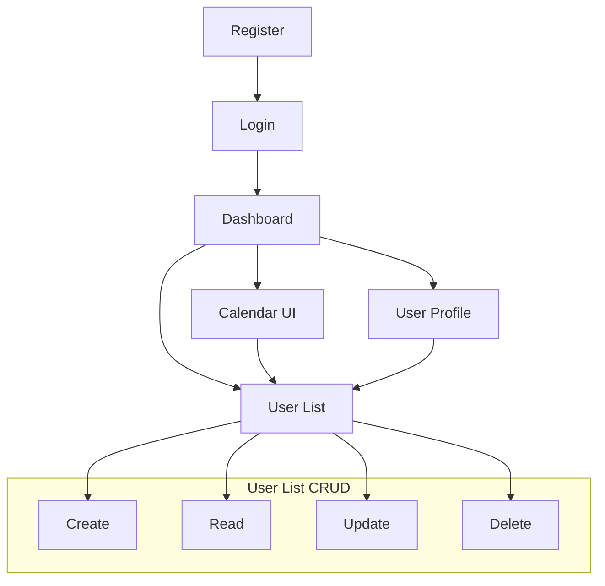
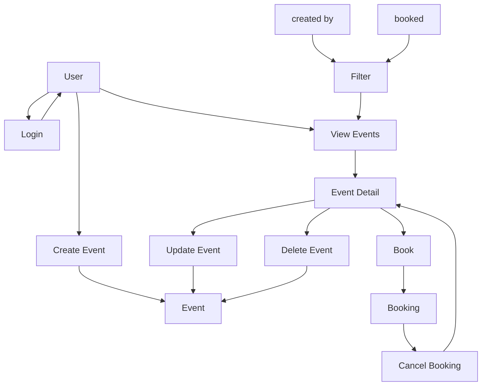
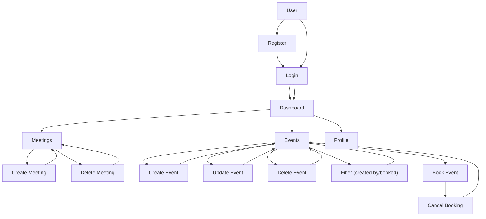

# Meeting Scheduler App

Monorepo containing a React (Vite + TS) client and an Express + GraphQL + Mongoose server.

## Tech stack

- Client:
  - React 16.13
  - TypeScript
  - Vite
  - Apollo Client v3
  - React Router
  - SCSS (Bootstrap 5 via SCSS with custom variables)
  - React Hook Form + Zod
- Server:
  - Express (for backend api implementation)
  - express-graphql
  - Mongoose
  - JWT
  - dotenv
  - Helmet
  - CORS
  - Morgan (logging)
  - UUID (request id)

## Screen Flow



### Event and Booking Screen Flow



## Event and Booking Screen Flow



## Project structure

```text
/client
├── public/
├── src/
│   ├── assets/
│   │   ├── images/
│   │   ├── icons/
│   │   └── scss/
│   │       ├── _variables.scss
│   │       └── main.scss
│   ├── components/
│   │   ├── atoms/
│   │   ├── molecules/
│   │   ├── organisms/
│   ├── graphql/
│   │   ├── mutations.ts
│   │   └── queries.ts
│   ├── pages/
│   │   ├── create-meeting/
│   │   ├── dashboard/
│   │   ├── login/
│   │   └── register/
│   ├── hooks/
│   ├── context/
│   │   └── AuthContext.tsx
│   ├── utils/
│   ├── apollo/
│   │   └── client.ts
│   ├── App.tsx
│   └── index.tsx
├── index.html
├── package.json
├── tsconfig.json
├── vite.config.ts
├── .env
├── .env.example
└── README.md

/server
├── config/
│   └── db.js
├── constants/
│   └── messages.js
├── graphql/
│   ├── resolvers/
│   │   ├── index.js
│   │   ├── user.js
│   │   ├── meeting.js
│   │   ├── event.js
│   │   └── booking.js
│   ├── type-defs/
│   │   ├── index.js
│   │   ├── user.js
│   │   ├── meeting.js
│   │   ├── event.js
│   │   └── booking.js
│   └── shared/
│       ├── helpers.js
│       └── scalars.js
├── middleware/
│   ├── auth.js
│   └── error.js
├── models/
│   ├── user-schema.js
│   ├── meeting-schema.js
│   ├── event-schema.js
│   └── booking-schema.js
├── utils/
│   ├── validators.js
│   ├── dateUtils.js
│   ├── mongoose-methods.js
│   └── logger.js
├── server.js
├── package.json
├── .eslintrc.cjs
├── .eslintignore
├── .prettierrc.json
└── .prettierignore

/README.md
```

## Coding Guidelines

```text
.rules/
├── coding-guideline.mdc          # 📋 Main overview & index
├── client-guidelines.mdc         # 📱 React/TypeScript/Apollo Client
├── server-guidelines.mdc         # 🚀 Express/GraphQL/Mongoose
└── shared-conventions.mdc        # 🔧 Common patterns & conventions
```

## Server development

### GraphQL modular structure

The server uses a modular GraphQL setup:

- Type definitions split by domain under `server/graphql/type-defs/` and combined by `index.js`
- Resolvers split by domain under `server/graphql/resolvers/` and combined by `index.js`
- Shared helpers and scalars under `server/graphql/shared/`

### Tooling: linting and formatting

From `server/`:

- Lint: `npm run lint`
- Lint (auto-fix): `npm run lint:fix`
- Prettier check: `npm run format:check`
- Prettier write: `npm run format`
- Combined check: `npm run check`

ESLint highlights:

- Extends: `eslint:recommended`, `plugin:node/recommended`, `plugin:import/recommended`, `plugin:security/recommended`, `plugin:prettier/recommended`
- Enforces sorted imports with `import/order` (builtin → external → internal → parent → sibling), newlines between groups, and alphabetical ordering
- Common quality rules enabled (e.g., `curly`, `eqeqeq`, `no-unused-vars`, `require-await`)

Prettier:

- Configured via `.prettierrc.json` and integrated with ESLint via `plugin:prettier/recommended`

Node versions (server):

- Engines: Node >= 22.14.0 < 23, npm >= 10 (see `server/package.json`)

## Testing Framework

The server includes a comprehensive testing suite built with Jest, covering all GraphQL resolvers, Mongoose models, middleware, and utilities. Tests ensure code quality, reliability, and maintain high coverage standards.

### Test Structure

```text
server/
├── __tests__/
│   ├── resolvers/
│   │   ├── user.test.js         ✅ (authentication & user management)
│   │   ├── meeting.test.js      ✅ (meeting CRUD operations)
│   │   ├── event.test.js        ✅ (event management & filtering)
│   │   └── booking.test.js      ✅ (booking system & cancellation)
│   ├── models/
│   │   ├── user.test.js         ✅ (schema validation & constraints)
│   │   ├── meeting.test.js      ✅ (database operations & population)
│   │   ├── event.test.js        ✅ (model constraints & relationships)
│   │   └── booking.test.js      ✅ (relationship tests & queries)
│   ├── middleware/
│   │   ├── auth.test.js         ✅ (JWT authentication & security)
│   │   └── error.test.js        ✅ (error handling & formatting)
│   └── utils/
│       ├── validators.test.js   ✅ (Zod schema validation)
│       └── dateUtils.test.js    ✅ (utility function testing)
├── tests/
│   ├── setup/
│   │   ├── testDb.js           ✅ (MongoDB Memory Server)
│   │   ├── testServer.js       ✅ (Apollo Server setup)
│   │   └── helpers.js          ✅ (test utilities & mocks)
│   └── integration/
│       └── graphql.test.js     ✅ (end-to-end workflows)
└── jest.config.js              ✅ (Jest configuration)
```

### Test Commands

From `server/`:

```bash
# Run all tests
npm test

# Run tests with coverage report
npm run test:coverage

# Run tests in watch mode (development)
npm run test:watch

# Run tests for CI/CD (with coverage)
npm run test:ci

# Run specific test categories
npm test -- __tests__/resolvers/
npm test -- __tests__/models/
npm test -- __tests__/middleware/

# Run specific test file
npm test -- __tests__/resolvers/user.test.js
```

### Test Coverage

| **Category**           | **Coverage** | **Focus Area**                                         |
| ---------------------- | ------------ | ------------------------------------------------------ |
| **GraphQL Resolvers**  | **96.23%**   | Authentication, CRUD operations, error handling        |
| **Mongoose Models**    | **100%**     | Schema validation, database constraints, relationships |
| **Middleware**         | **77.14%**   | JWT authentication, error formatting, security         |
| **Utils & Validators** | **75%+**     | Zod schemas, date utilities, helper functions          |

### Coverage Reports

Coverage reports are generated in multiple formats:

- **Terminal**: Real-time coverage summary during test execution
- **HTML**: `coverage/lcov-report/index.html` - Interactive browser report
- **LCOV**: `coverage/lcov.info` - For CI/CD integration
- **JSON**: `coverage/coverage-final.json` - For automated processing

### Test Categories

#### 1. Resolver Tests (`__tests__/resolvers/`)

Comprehensive testing of all GraphQL resolvers with mocked dependencies:

**User Resolver (`user.test.js`)**

- ✅ User registration with validation
- ✅ User authentication (login/logout)
- ✅ Password hashing and verification
- ✅ JWT token generation and validation
- ✅ Profile management and updates
- ✅ Error handling (invalid credentials, validation failures)

**Meeting Resolver (`meeting.test.js`)**

- ✅ Meeting creation with attendees
- ✅ Meeting retrieval and filtering
- ✅ Meeting deletion (owner permissions)
- ✅ Authentication and authorization checks
- ✅ Input validation and error handling

**Event Resolver (`event.test.js`)**

- ✅ Event CRUD operations
- ✅ Event filtering and pagination
- ✅ Owner-based permissions
- ✅ Date and price validation
- ✅ Database error handling

**Booking Resolver (`booking.test.js`)**

- ✅ Event booking creation
- ✅ Booking cancellation
- ✅ Duplicate booking prevention
- ✅ User ownership validation
- ✅ Event availability checks

#### 2. Model Tests (`__tests__/models/`)

Real database testing with MongoDB Memory Server for complete isolation:

**User Model (`user.test.js`)**

- ✅ Schema validation (required fields, data types)
- ✅ Unique constraints (email uniqueness)
- ✅ Password hashing with bcrypt
- ✅ Email format validation with regex
- ✅ Database operations (create, read, update, delete)

**Meeting Model (`meeting.test.js`)**

- ✅ Required field validation (title, startTime, endTime, createdBy)
- ✅ Date validation and constraints
- ✅ Attendee population and references
- ✅ Creator population and ownership
- ✅ Complex queries (date ranges, attendee filtering)

**Event Model (`event.test.js`)**

- ✅ Price validation (numeric, decimal support)
- ✅ Date handling and timezone support
- ✅ Title trimming and sanitization
- ✅ Creator relationship validation
- ✅ Sorting and filtering operations

**Booking Model (`booking.test.js`)**

- ✅ Event and user reference validation
- ✅ Population of related entities
- ✅ Duplicate booking scenarios
- ✅ Cascading queries and filters
- ✅ Timestamp tracking and updates

#### 3. Middleware Tests (`__tests__/middleware/`)

Security and error handling validation:

**Authentication Middleware (`auth.test.js`)**

- ✅ JWT token validation and parsing
- ✅ Bearer token extraction from headers
- ✅ Token expiration handling
- ✅ Invalid token scenarios
- ✅ Security edge cases (malformed tokens, missing secrets)

**Error Middleware (`error.test.js`)**

- ✅ MongoDB error normalization (duplicate keys)
- ✅ Zod validation error formatting
- ✅ GraphQL error standardization
- ✅ HTTP status code mapping
- ✅ Request ID correlation for debugging

#### 4. Utility Tests (`__tests__/utils/`)

Core utility function validation:

**Validators (`validators.test.js`)**

- ✅ Zod schema validation (Register, Login, UpdateProfile)
- ✅ Input sanitization and trimming
- ✅ Email format validation
- ✅ Password strength requirements
- ✅ Error message formatting

**Date Utils (`dateUtils.test.js`)**

- ✅ Date range validation logic
- ✅ Timezone handling and edge cases
- ✅ Invalid date detection
- ✅ Millisecond precision testing
- ✅ Leap year and boundary conditions

#### 5. Integration Tests (`tests/integration/`)

End-to-end workflow testing with real GraphQL operations:

**GraphQL Integration (`graphql.test.js`)**

- ✅ Complete authentication flow (register → login → operations)
- ✅ Protected operations with JWT tokens
- ✅ Real database persistence and retrieval
- ✅ Complex multi-step workflows
- ✅ Error propagation and handling
- ✅ Request/response validation

### Testing Infrastructure

#### Test Database (MongoDB Memory Server)

- **Isolation**: Each test suite runs with a fresh in-memory MongoDB instance
- **Performance**: Fast test execution without external database dependencies
- **Cleanup**: Automatic database reset between test cases
- **Real Operations**: Full MongoDB functionality for integration testing

#### Mock Strategy

- **Unit Tests**: External dependencies mocked (database, external services)
- **Integration Tests**: Real database with MongoDB Memory Server
- **Resolver Tests**: Mongoose methods and helpers mocked for fast execution
- **Model Tests**: Real database operations for validation testing

#### Test Utilities and Helpers

```javascript
// Test data factories
createTestUser({ name: 'John', email: 'john@example.com' });
createTestMeeting({ title: 'Team Sync', attendees: [userId] });
createTestEvent({ title: 'Conference', price: 99.99 });

// Authentication helpers
createMockAuthRequest(userId);
generateToken(userId);
hashPassword('password123');

// GraphQL query templates
TEST_QUERIES.REGISTER;
TEST_QUERIES.LOGIN;
TEST_QUERIES.CREATE_MEETING;
```

### CI/CD Integration

Test configuration optimized for continuous integration:

```javascript
// jest.config.js highlights
module.exports = {
  testEnvironment: 'node',
  collectCoverageFrom: [
    'graphql/**/*.js',
    'models/**/*.js',
    'middleware/**/*.js',
  ],
  coverageThreshold: {
    global: { branches: 80, functions: 80, lines: 80, statements: 80 },
  },
  testTimeout: 10000,
  setupFilesAfterEnv: ['<rootDir>/tests/setup/testSetup.js'],
};
```

### Testing Best Practices

1. **Test Isolation**: Each test runs independently with fresh state
2. **Real Data**: Use realistic test data matching production scenarios
3. **Error Testing**: Comprehensive validation of error conditions
4. **Security Testing**: Authentication, authorization, and input validation
5. **Performance**: Fast execution with in-memory database and efficient mocking

### Diagram: Testing Architecture


This comprehensive testing framework ensures:

- **Code Quality**: High coverage with meaningful tests
- **Reliability**: Confidence in GraphQL operations and data integrity
- **Security**: Thorough validation of authentication and authorization
- **Maintainability**: Clear test structure and comprehensive documentation
- **CI/CD Ready**: Automated testing with coverage reporting

## Run locally

1. Create `server/.env` (example values)

```bash
PORT=4000
MONGO_URI=mongodb://localhost:27017/meeting_scheduler
JWT_SECRET=replace_me
CLIENT_ORIGIN=http://localhost:5173
NODE_ENV=development
```

1. Install dependencies

```bash
cd client && npm install
cd server && npm install
```

1. Start apps

```bash
cd server && npm run dev
cd client && npm run dev
```

The client proxies `/graphql` to `http://localhost:4000` during development.

## Data flow (client → server → DB → client)

1. User interacts with UI (e.g., Login/Register forms). React Hook Form handles input state and validation (Zod).
2. On submit, Apollo Client sends GraphQL operations to `/graphql`. An auth link adds `Authorization: Bearer <token>` when present in `localStorage`.
3. Vite dev server proxies the request to the Express server.
4. Express middleware pipeline: Helmet → Request ID injection (UUID) → Morgan request logging → CORS → JSON body parsing → JWT auth middleware (sets `req.userId` if token valid).
5. `express-graphql` executes the operation against the schema/resolvers. The GraphQL context includes `{ req }` so resolvers can read `req.userId`.
6. Resolvers access MongoDB via Mongoose models (`User`, `Meeting`).
7. Response is returned to the client. Errors are formatted by a centralized formatter that adds `extensions.code`, `extensions.requestId`, and Zod `details` for validation errors.
8. Apollo Client normalizes and caches results; components re-render from the cache.

### Diagram: Data flow


## Validation flow

### Client-side (React Hook Form + Zod)

- Login: `{ email: z.string().email(), password: z.string().min(6) }`
- Register: `{ name: z.string().min(2), email: z.string().email(), password: z.string().min(6) }`
- `zodResolver` runs on change and submit. Errors are shown inline. RHF DevTools are enabled in non-production for easier debugging.

### Server-side (Zod + centralized error formatting)

- Register/Login: parsed using Zod schemas before executing business logic.
- CreateMeeting: parsed with a Zod schema that checks ISO date strings and `startTime < endTime`.
- On validation failure, the `customFormatErrorFn` returns `extensions.code = BAD_USER_INPUT` and `extensions.details` (Zod issues). Other errors surface as `INTERNAL_SERVER_ERROR` without stack traces.

### Diagram: Validation flow


## GraphQL data fetching

### Transport and auth

- Apollo Client uses `HttpLink` to `/graphql` and an `authLink` that adds a Bearer token from `localStorage` (`ms_token`).
- Server reads the token in `authMiddleware`, verifies JWT, and sets `req.userId` for resolvers.

#### Diagram: Auth transport


### Operations

- Queries:
  - `Me`: returns current user (requires auth).
  - `Meetings`: returns meetings where user is creator or attendee (requires auth).
- Mutations:
  - `register`, `login`: return `{ token, user }`.
  - `createMeeting`, `deleteMeeting`: require auth; creators can delete their own meetings.

#### Diagram: Operations map


## Caching

### Client-side (Apollo InMemoryCache)

- Default normalization by `id`/`__typename`. Results from queries/mutations are normalized into the cache.
- Current pages use queries (`GET_ME`, `GET_MEETINGS`) that are cached by Apollo. Subsequent renders read from cache first.
- Improvement suggestion: when logging out, call `apolloClient.clearStore()` to drop cached user data in addition to clearing `localStorage`.
- No custom type policies have been added yet; defaults are used.

### Server-side

- No server-side caching is configured at this time.

### Diagram: Caching


## Validation stages (end-to-end)

1. UI level: HTML input attributes and RHF field state.
2. Schema level (client): Zod schemas ensure shape and basic constraints before sending the request.
3. Transport level: Apollo adds JWT; if missing/invalid, protected resolvers throw `Not authenticated`.
4. Schema level (server): Zod parses mutation inputs; errors are returned as `BAD_USER_INPUT` with details.
5. Data level: Mongoose schema constraints (required, types, refs). Passwords are hashed with bcrypt before persistence.

## Security

- JWT auth with `Authorization: Bearer` header; token expires in 7 days.
- Passwords hashed with `bcryptjs` (10 salt rounds in current setup).
- Helmet sets common security headers.
- CORS restricted to `CLIENT_ORIGIN` from env; credentials enabled.
- Request logging with `morgan`; every request tagged with a UUID for traceability.
- GraphiQL enabled only in non-production.
- Error formatter avoids leaking stack traces; includes `requestId` for correlation.

### Diagram: Security pipeline (server)


### Recommended hardening (future work)

- Add rate limiting (e.g., `express-rate-limit`) and IP throttling.
- Add query depth/complexity limits for GraphQL.
- Implement refresh tokens/short-lived access tokens, token revocation.
- Enforce stronger password policies and account lockout/backoff.
- Sanitize and validate MongoDB ObjectIds robustly where applicable.
- Call `apolloClient.clearStore()` on logout on the client side.

## Domain model

### Diagram: Entities


## Event & Booking GraphQL API (Design)


## Frontend flow: Events and Bookings


